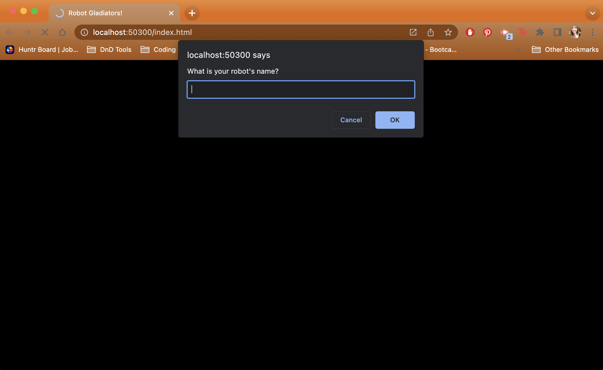
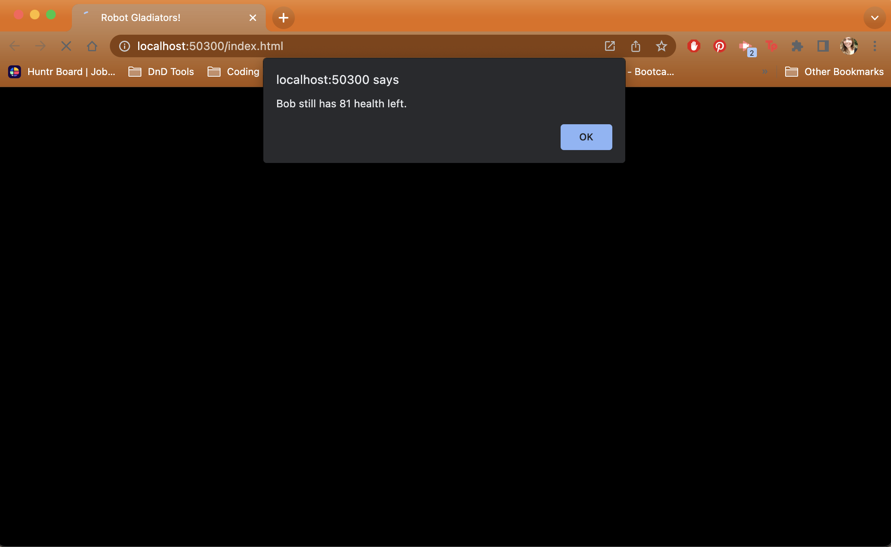
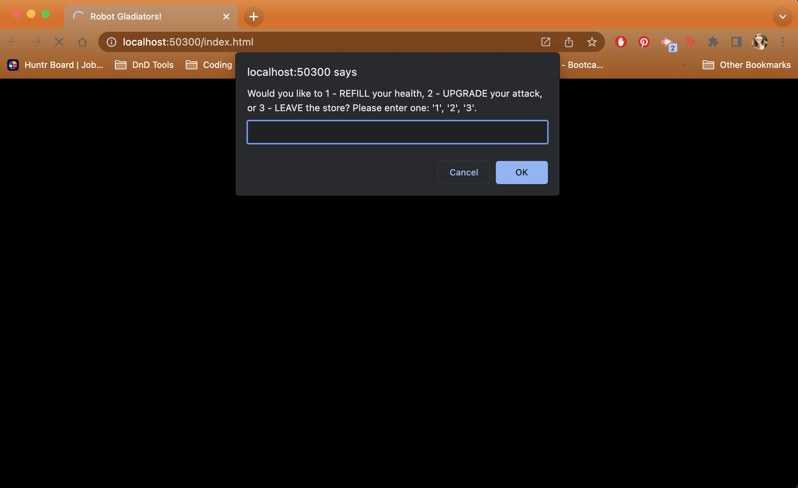
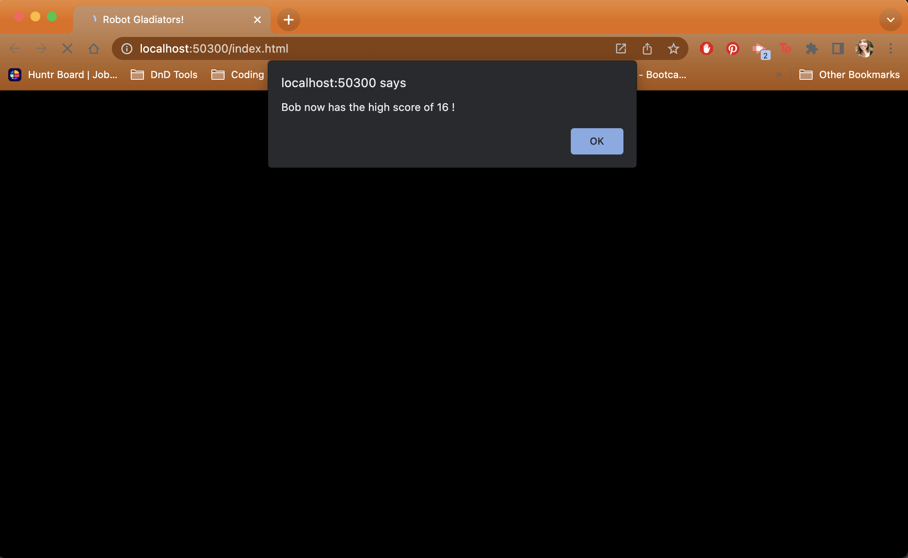

# Robot Gladiators

## Description

MVP browser-based text-only video game written in JavaScript. Robot Gladiators is a combat simulator game with a series of fight rounds where the player gains cash, attack power, and can repair along the way. The robot that survives with the most cash is remembered in the browser's storage system!

## Table of Contents

- [Installation](#installation)
- [Usage](#usage)
- [Credits](#credits)

## Installation

Since Robot Gladiators is a minimal browser-based MVP, in order to play you will need to clone the repository to your personal computer. To start the game, navigate to the index.html file, right click and select 'Open in Browser'. Now follow the browser's alert prompts in order to play the game!

## Usage

Screenshots of Gameplay
 
 

 
 

 
 

 
 

## Credits

Made with 💛 by me, Charlie.
You can see more of my work [here](https://github.com/charliec1665)